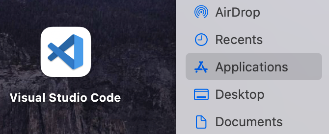
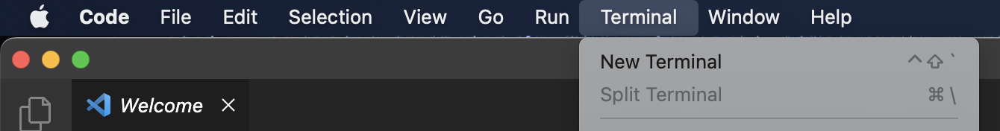
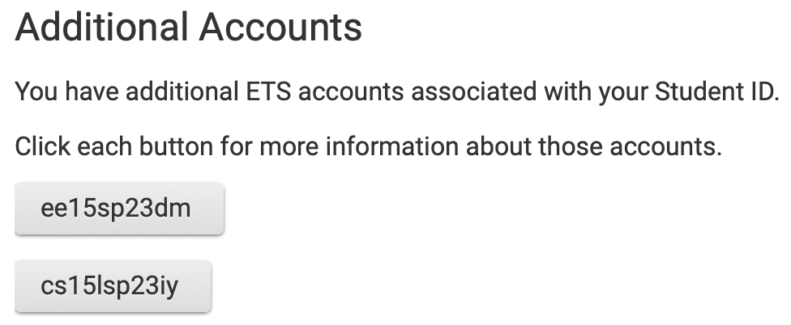
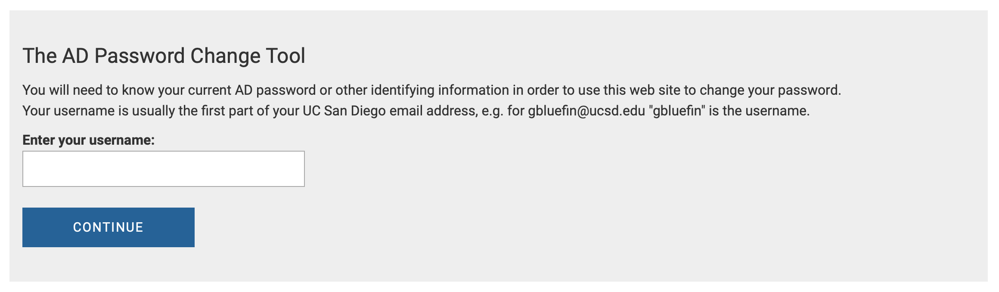

# Lab Report 1

## Installing VS Code for Mac
  1. [Go to the website for download options.](https://code.visualstudio.com/download)
  2. Download the version for Mac.
  3. Open Finder
  4. Move the downloaded file to the Applications folder. 
  5. Open VS Code.
  6. Open a new terminal using the top menu bar. 
  

## Remotely Connecting
  1. [Look up your course account.](https://sdacs.ucsd.edu/~icc/index.php)
  2. Fill out the Account Lookup with your student username and ID. Your username is whatever is front of @ucsd.edu in your UCSD email.
  3. Click on the button that says "cs15lsp23XX". This is your course account username. Write it down somewhere because you will need it to login. 
  4. Proceed to the password change tool to set your password. Make sure to enter your course account username and not your student username. 
  6. Now you are ready to remotely access the ucsd servers. Type the following command into the VS Code terminal, replacing username with your username.
  ```
  ssh username@ieng6.ucsd.edu
  ```
  4. Enter your password. The terminal will stay empty, so type it out completely then return.
  

## Trying Some Commands
  Use the following commands to create, move, and delete files.
  * `pwd`: Print the folder you are in.
  * `ls`: List folders and files inside the current folder.
  * `mkdir hello`: Makes a new folder called hello.
  * `cd hello`: Moves into the folder called hello.
  * `cd ..`: Moves one level out of the current folder.
  * `rmdir hello`: Deletes the folder called hello.
  * `cat`: Reads contents from a file. [Read the documentation.](https://www.geeksforgeeks.org/cat-command-in-linux-with-examples/)
  * `cp`: Copies files. [Read the documentation.](https://www.geeksforgeeks.org/cp-command-linux-examples/)
  
