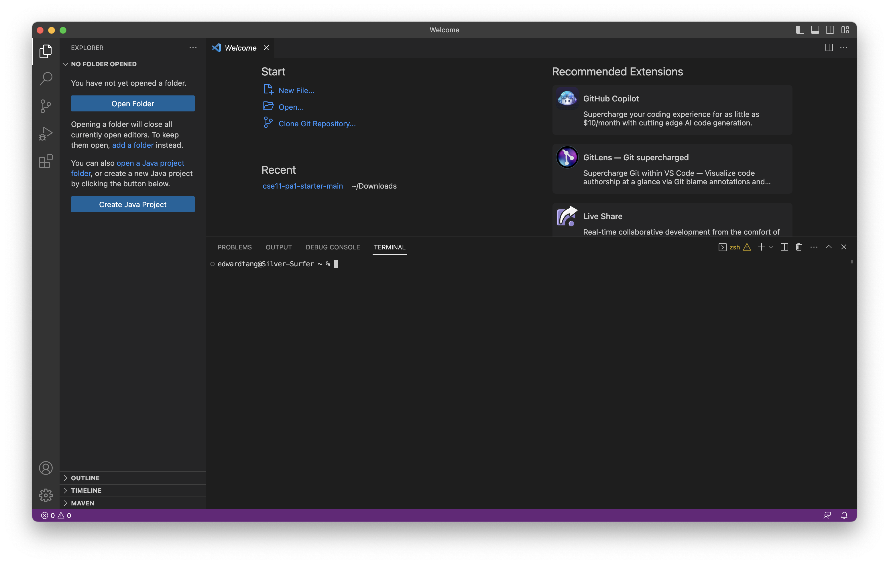
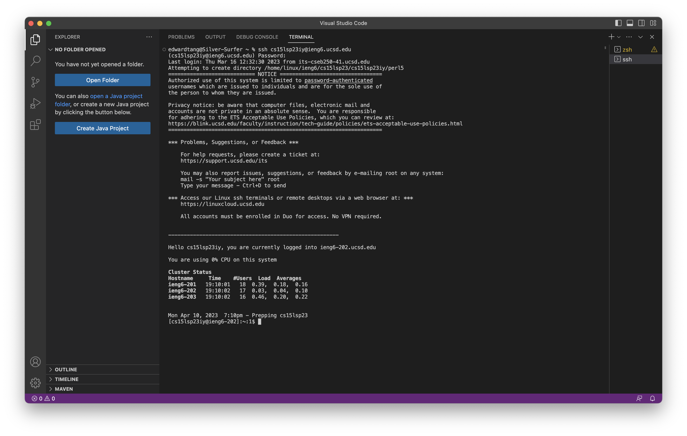
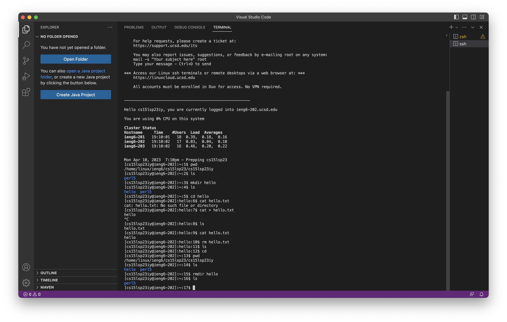

# Lab Report 1

## Installing VS Code
1. [Download VS Code for your device.](https://code.visualstudio.com/download)
2. Open a new terminal.


## Remotely Connecting
1. [Look up your course account.](https://sdacs.ucsd.edu/~icc/index.php)
2. Reset the password.
3. Type the following command into the VS Code terminal, replacing username with your username.
```
ssh username@ieng6.ucsd.edu
```
4. Enter your password. The terminal will stay empty, so type it out completely then return.


## Trying Some Commands
Use the following commands to create, move, and delete files.
* `pwd`: Print the folder you are in.
* `ls`: List folders and files inside the current folder.
* `mkdir hello`: Makes a new folder called hello.
* `cd hello`: Moves into the folder called hello.
* `cd ..`: Moves one level out of the current folder.
* `rmdir hello`: Deletes the folder called hello.
* `cat`: Reads contents from a file. [Read the documentation.](https://www.geeksforgeeks.org/cat-command-in-linux-with-examples/)
* `cp`: Copies files. [Read the documentation.](https://www.geeksforgeeks.org/cp-command-linux-examples/)

