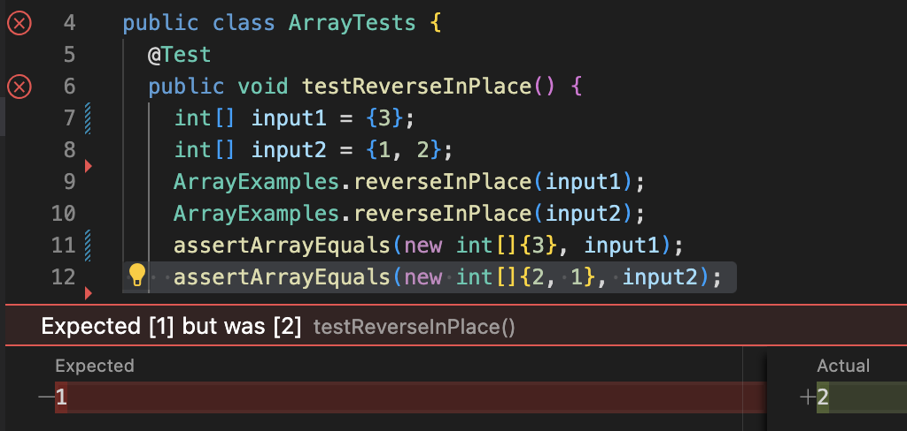

# Lab Report 2

## Part 1: StringServer
Code for StringServer:


First use of `/add-message`:

The following methods are called when [http://localhost:4321/add-message?s=1234](http://localhost:4321/add-message?s=1234) is visited.
  * `Integer.parseInt(args[0])` args[0] = 4321. This is given when running the command "java NumberServer 4321".
  * `Server.start(port, new Handler())` port = 4321.
  * `url.getPath().contains("/add-message")` Checking for the correct path "/add-message."
  * `url.getQuery().split("=")` Isolating the string "1234". This is stored in field "theString".

Second use of `/add-message`:

The following methods are called when [http://localhost:4321/add-message?s=abcd](http://localhost:4321/add-message?s=abcd) is visited.
  * `Integer.parseInt(args[0])` args[0] = 4321. This hasn't changed because the server is still active.
  * `Server.start(port, new Handler())` port = 4321.
  * `url.getPath().contains("/add-message")` Checking for the correct path "/add-message."
  * `url.getQuery().split("=")` Isolating the string "abcd". "theString" is concatenated with "\n" and then "abcd"

## Part 2: Bugs


Calling reverseInPlace on {3} does not induce failure because the the array has only 1 element, and there is nothing to be reversed. The element is set to itself. The tester moves onto the next test case.

Calling reverseInPlace on {1, 2} induces failure. The first half of the array is reversed correctly, but because the values are overwritten, the second half cannot be assigned the correct values. The tester fails.

Buggy code:
```
Static void reverseInPlace(int[] arr) {
  for(int i = 0; i < arr.length; i += 1) {
    arr[i] = arr[arr.length - i - 1];
  }
```
In order to reverse an array, values on opposite sides need to be swapped. However, the element that gets reassigned first will have its value overwritten, and then the second element cannot be reassigned. In order to fix this bug, a temporary variable is needed so that first element can store its old value before reassignment. Then the second element can be reassigned the the temporary variable, completing the swap. In addition, the loop should only iterate through half of the array. If it keeps going, it will reverse the values again and go back to what it started with.

Corrected code:
```
Static void reverseInPlace(int[] arr) {
  for(int i = 0; i < arr.length/2; i += 1) {
    int temp = arr[i];
    arr[i] = arr[arr.length - i - 1];
    arr[arr.length - i - 1] = temp;
  }
```

## Part 3: New Learning
I learned how to create a simple website that can be visited in a browser. One kind of functionality which I implemented is keeping track of how many times a website is visited. This is done by updating a class field which has a lifetime for as long as the server is running. It also depends on being able to take information from parts of the url, such as the path and the query. I can make the website behave differently depending on the path that is visited in the browser. I can also make the website available to other people by hosting it on the ieng6 servers. The website will keep track of every visit from my computer and others.
