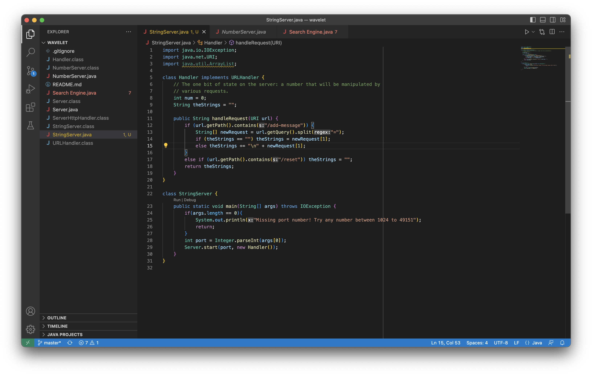
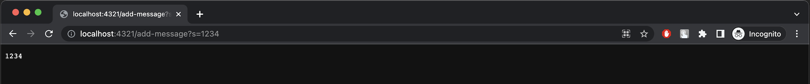
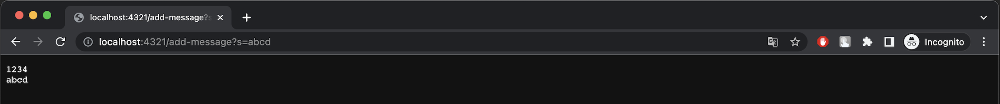

# Lab Report 1

## Part 1: StringServer
Code for StringServer:


First use of /add-message:

The following methods are called when "http://localhost:4321/add-message?s=1234" is visited.
  * `Integer.parseInt(args[0])` args[0] = 4321. This is given when running the command "java NumberServer 4321".
  * `Server.start(port, new Handler())` port = 4321.
  * `url.getPath().contains("/add-message")` Checking for the correct path "/add-message."
  * `url.getQuery().split("=")` Isolating the string "1234". This is stored in field "theString".

Second use of /add-message:

The following methods are called when "http://localhost:4321/add-message?s=abcd" is visited.
  * `Integer.parseInt(args[0])` args[0] = 4321. This hasn't changed because the server is still active.
  * `Server.start(port, new Handler())` port = 4321.
  * `url.getPath().contains("/add-message")` Checking for the correct path "/add-message."
  * `url.getQuery().split("=")` Isolating the string "abcd". "theString" is concatenated with "\n" and then "abcd"

## Part 2: Bugs
Failure-Inducing Input:
```
int[] input1 = {1, 2};
ArrayExamples.reverseInPlace(input1);
assertArrayEquals(new int[]{2, 1}, input1);
```
Successful Input:
```
int[] input2 = {3};
ArrayExamples.reverseInPlace(input2);
assertArrayEquals(new int[]{3}, input2);
```
In order to fix this bug, a temporary variable needed to be added to store values.

## Part 3: New Learning
I learned how to create a simple website that can be visited in a browser. One kind of functionality which I implemented is keeping track of how many times a website is visited. This is done by updating a class field which has a lifetime for as long as the server is running. It also depends on being able to take information from parts of the url, such as the path and the query. I can make the website behave differently depending on the path that is visited in the browser. I can also make the website available to other people by hosting it on the ieng6 servers. The website will keep track of every visit from my computer and others.
