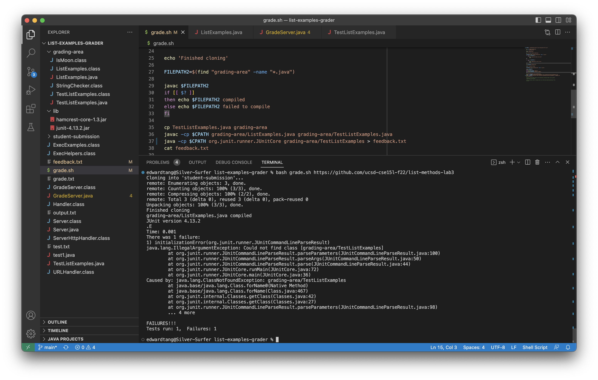
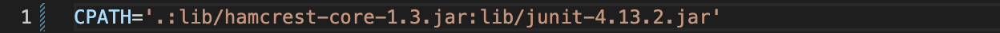
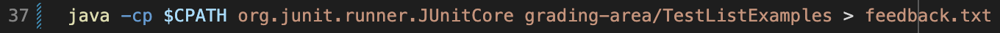
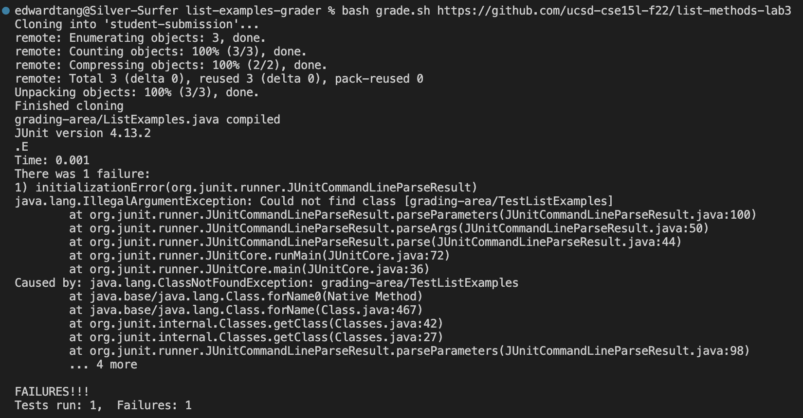
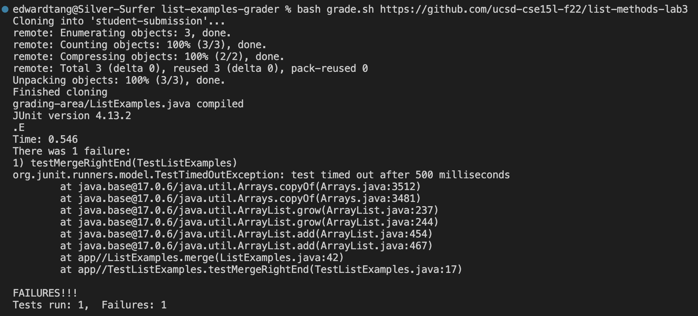

# Lab Report 5

## Debugging Scenario
Chapter 1. Student Posts on EdStem
> Hello I am on a mac. When I run the script it says it can't find TestListExamples. I'm sure that the filepath is correct. The working directory is always list-examples-grader so I'm compiling grading-area/ListExamples.java and grading-area/TestListExamples.java. Send help.

  
  
Chapter 2. TA Response
> The filepaths in line 36 look okay so that leaves the classpath. The line where you defined CPATH is not visible in the screenshot. Can you make sure you have all relevant directories listed there? Also, in line 37 the way you have it written would cause another error. Right now it's trying to run a class called "grading-area/TestListExamples". In other words, it thinks the whole thing is a file name and not a file path.
  
  
Chapter 3. Student Success?  
The student must realize that they need to add grading-area to the CPATH definition.  
  Before:
  
  After:
  
Also, they need to remove grading-area from the javac line.  
  Before:
  
  After:
  
Then the output will be correct.  
  Before:
  
  After:
  

Chapter 4: Setup
This scenario uses code from week 6. Running `bash grade.sh https://github.com/ucsd-cse15l-f22/list-methods-lab3` caused an error because it couldn't compile one of the java files. This is because the classpath was missing an element. The java file was in a subdirectory, which needed to be specified in the `$CPATH` variable. After fixing the classpath, the student would have enountered another error. When running the `java` command, it expects a file name and not a file path. There shouldn't be any `/` in the argument being passed.

## Reflection
Before I began studying computer science, I would see my older brother doing things on Github all the time. Somtimes I would download code from Github to mod videogames, but I didn't really know what it was. What I did know was that it was something for coding people. The second half of the quarter taught me things that made me feel like one of those people. Although I'm sure the topics we covered are super basic and hardly scratch the surface, I feel like I can call myself a programmer without any reservations. No longer do I have to type in my password like some plebian, because I know what bash is and I can write a script to do it for me. In the first half of the quarter I wrote a bootleg script that had my actual password written out, but now I've upgraded to a secure version which utilizes private/public key encryption. After learning about Github and git commands, I think I would be able to understand all that stuff I saw my brother doing. And now that I know the basics; fork and clone, add and commit, push and pull, I can collaborate with other people. Whether it's fellow students or internet strangers, we can exchange code and give back something new and improved. I don't even have to open a code editor, since I can make changes directly from the terminal with vim. Knowing my way around the command line and common fixtures in programming makes me feel more prepared for the upper division classes next year.
