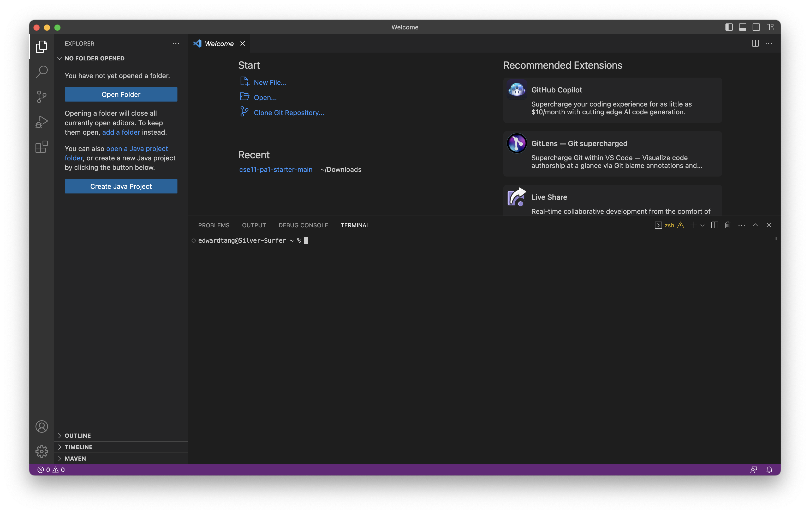
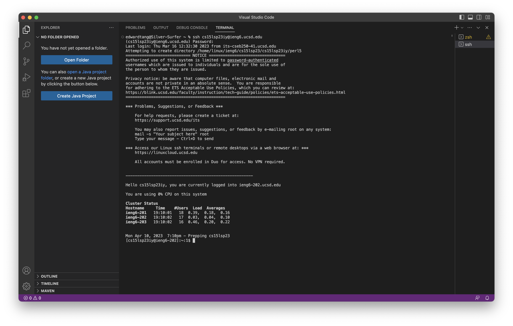

# Lab Report 1

## Installing VS Code
1. [Download VS Code for your device.](https://code.visualstudio.com/download)
2. Open a new terminal

---
## Remotely Connecting
1. [Look up your course account]
2. Reset the password
3. Type the following command into the VS Code terminal, replacing <your username> with your username
```
ssh <your username>@ieng6.ucsd.edu
```
4. Enter your password. The terminal will stay empty, so type it out completely then return

## Trying Some Commands
